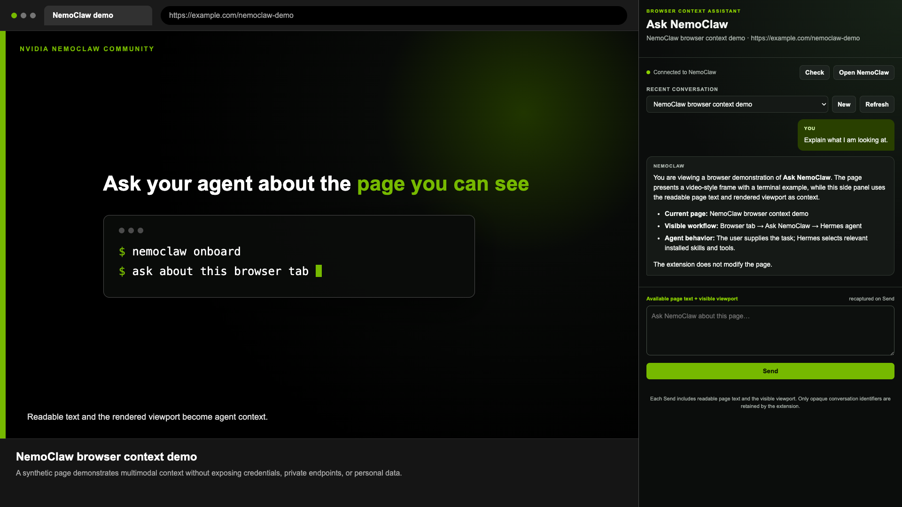
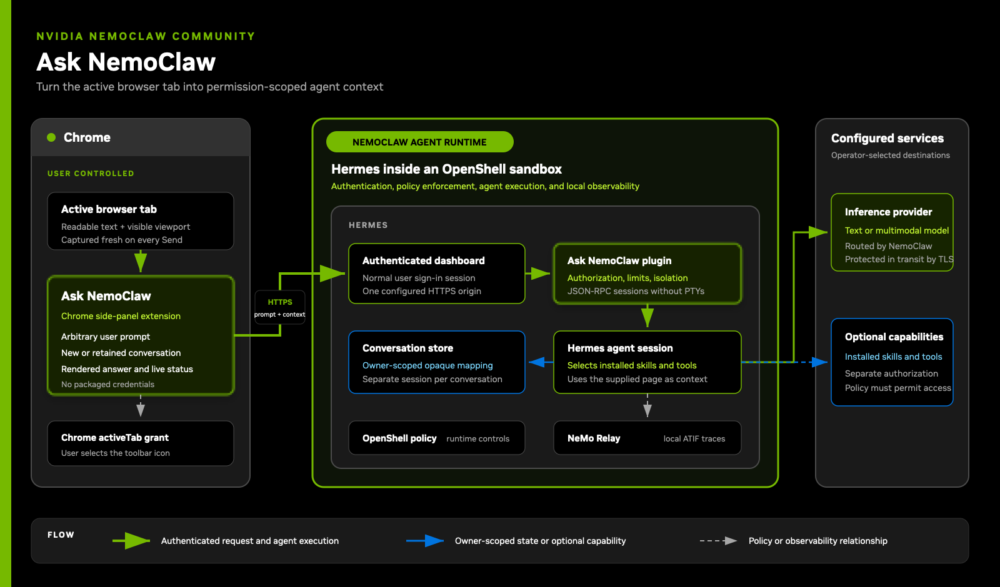

<!--
  SPDX-FileCopyrightText: Copyright (c) 2026 NVIDIA CORPORATION & AFFILIATES. All rights reserved.
  SPDX-License-Identifier: Apache-2.0
-->

# Ask NemoClaw

| Catalog field | Value |
| --- | --- |
| Description | Adds an authenticated Chrome side panel that sends an arbitrary user prompt, readable page text, and the rendered visible viewport to a NemoClaw agent running with Hermes. |
| Industry | ✨ Other |
| Requirements | NemoClaw with Hermes · x86-64 Linux and Docker · Chrome 116+ · inference provider API key · Brev or another Linux host |
| NemoClaw | Unpinned |
| Harness | Hermes Unpinned |
| OpenShell | Unpinned |

This NVIDIA-authored recipe adds a small browser interface to NemoClaw running
with Hermes. A user
opens a web page, selects the **Ask NemoClaw** extension, and asks a question.
Every message includes a fresh capture of the active page's readable text and
a bounded JPEG image of the currently visible viewport.
The NemoClaw agent keeps the conversation and decides which installed skills are relevant
to the user's prompt.

The extension does not modify the page. It does not contain a Hermes password,
an inference API key, or an OAuth token.

## Screenshot



This reproducible fixture shows the current extension interface without using a
private endpoint, personal profile, credential, or retained production
conversation. The page and response are synthetic; the same extension code is
used for the side-panel rendering.

## At A Glance

| Question | Answer |
| --- | --- |
| Category | NVIDIA Recipe |
| Contributor or provenance | NVIDIA-authored example for the public NemoClaw Community repository. |
| Use this when | A user wants to ask a NemoClaw agent about the page currently open in Chrome without copying the page text manually. |
| You will get | A Chrome side panel with retained, isolated Hermes conversations, current-page context on every message, and local NeMo Relay ATIF traces. |
| Runs on | A Linux host that can run NemoClaw and Docker. The tested deployment path uses the NemoClaw Brev launchable. |
| Requires | Chrome 116+, NemoClaw with Hermes, Docker, and an inference provider credential entered during NemoClaw onboarding. |
| Verified on | Static and local tests. Live Brev verification is in progress and must be completed before the example is submitted. |
| Evidence level | local/static |
| Support and maturity | Educational example with best-effort community support. See the repository [support policy](../../../../SUPPORT.md). |
| External access, data, and actions | Sends the active page URL, title, readable page text, selected text, rendered visible viewport, and user prompt to the configured Hermes inference provider. The base recipe does not write to the page or call Google Drive. Any tool action still requires an installed Hermes tool, credentials, and an OpenShell policy that permits its exact destination. |
| Start here | [Launch the Brev environment](#start-here), then prepare the custom Hermes image and load the unpacked extension. |
| Confirm success | [Verification](#verification) |

## Architecture



Chrome grants temporary access to the active tab after the user selects the
extension. Ask NemoClaw sends the prompt and bounded browser context to one
authenticated Hermes origin. The plugin maps each browser conversation to a
separate non-PTY Hermes session. Hermes selects installed skills and tools,
OpenShell applies runtime controls, and NeMo Relay records local ATIF traces.

The Chrome extension can reach only an origin granted through Chrome host
permissions. An authenticated HTTPS ingress is the recommended community
deployment. The standard service URL is
`https://<hermes-host>/api/plugins/ask-nemoclaw`. A reverse proxy may expose the
same API at another path without changing the Hermes plugin.

The initial origin and paths are set when the extension is built. The side
panel's **Settings** control can request Chrome permission for a different
origin and accepts a service URL with a deployment-specific path. The dashboard
URL is configured separately, but must use the same origin. This keeps the
extension portable while preventing it from opening an unrelated site.

The plugin accepts the pinned public extension identifier generated by the
manifest's public key. This value identifies the extension origin; it is not a
credential. An enterprise distribution can set
`HERMES_ASK_NEMOCLAW_EXTENSION_ID` to its centrally published extension ID.

## Security Boundary

Page text and rendered pixels are untrusted input. The plugin wraps them
separately from the signed-in user's prompt and tells Hermes not to treat page
content as instructions. This
reduces prompt-injection risk, but it does not make untrusted content safe by
itself. OpenShell remains the enforcement boundary for network access and
external tools.

The base recipe:

- requires an authenticated Hermes session for shared HTTPS deployments;
- permits a single local development identity only when the prepared image
  explicitly enables loopback mode through its environment or a root-owned,
  read-only marker and the request host is loopback;
- verifies the browser origin;
- strips URL credentials, fragments, and query parameters for every site;
- limits request and response sizes;
- accepts only a bounded, browser-generated JPEG viewport image;
- permits viewport-only context when a canvas-based or otherwise rendered page
  does not expose readable DOM text;
- attaches that image to the same Hermes session that receives the prompt;
- removes the temporary gateway image after the turn completes;
- requires an idempotency key for each message;
- isolates conversations by the authenticated Hermes user;
- creates a separate Hermes session for every new side-panel conversation;
- reuses that session only for later messages in the same conversation;
- never allocates a terminal or PTY; and
- performs no page writes and adds no external egress policy.

NeMo Relay runs inside the Hermes process. It writes Agent Trajectory
Interchange Format (ATIF) files to
`/sandbox/.hermes-data/nemo-relay/atif`. These files can contain the user's
prompt, captured page context, model output, and tool events. Treat them as
sensitive data. The base recipe does not send traces to an OpenTelemetry or
other external collector.

The text capture uses `document.body.innerText`. The viewport capture adds the
currently rendered charts, images, canvas content, layout, and formatting. It
does not capture content above or below the visible viewport, other tabs, or
Chrome's toolbar. Chrome internal pages are rejected. A page without readable
DOM text can still be submitted when the extension captures a valid viewport
image.

The inference path must provide image understanding. Use either a multimodal
primary model or a configured Hermes auxiliary vision model. A text-only model
without auxiliary vision cannot process the viewport image and produces a
vision-configuration failure. Confirm that the configured provider is approved
to receive the rendered page image and readable page text.

## Start Here

### 1. Create a Brev host

Open the [NemoClaw Brev launchable](https://brev.nvidia.com/launchable/deploy/now?launchableID=env-3Azt0aYgVNFEuz7opyx3gscmowS)
and create one instance. At the time this recipe was prepared, the launchable
selected a CPU-only `n2d-standard-4` instance with 4 vCPUs, 16 GiB RAM, and
256 GB storage. Brev showed a compute price of `$0.133838/hour` and separate
storage pricing. Prices and available instance types can change; review the
current Brev confirmation page before creating the instance.

Stop or delete the instance when you finish. A stopped instance can continue
to incur storage charges.

### 2. Install or update NemoClaw for Hermes

Connect to the Brev instance and run the maintained installer from a temporary
directory:

```bash
cd /tmp
curl -fsSL https://www.nvidia.com/nemoclaw.sh \
  | NEMOCLAW_AGENT=hermes bash
```

The installer requires the operator to review and explicitly accept the
third-party software terms. Do not automate that acceptance for another user.
If you accept the displayed terms, follow the installer's documented acceptance
prompt or flag.

#### Brev launchable compatibility check

Perform the update before creating a sandbox. Some older revisions of the
NemoClaw Brev launchable use Docker's containerd snapshotter and an older,
externally supervised OpenShell gateway. The current CLI cannot complete
onboarding until both host components are compatible. These changes restart
Docker and the gateway, so use this procedure only on a fresh instance with no
sandboxes. First confirm that `openshell sandbox list` reports no sandboxes.

If the installer reports `host.docker.storage_incompatible` and `docker info`
shows `io.containerd.snapshotter.v1`, select the classic overlay2 driver:

```bash
printf '%s\n' \
  '{' \
  '  "features": {' \
  '    "containerd-snapshotter": false' \
  '  }' \
  '}' \
  | sudo tee /etc/docker/daemon.json >/dev/null
sudo systemctl restart docker
docker info --format 'Driver={{.Driver}} Status={{json .DriverStatus}}'
```

The result must report `Driver=overlay2` and must not contain
`io.containerd.snapshotter.v1`.

If the Brev launchable uses the system service
`openshell-gateway.service`, synchronize that service with the OpenShell
installation supplied by the updated NemoClaw CLI, then wait for the gateway
API rather than relying only on systemd's process state:

```bash
sudo install -o root -g root -m 0755 \
  "$HOME/.local/bin/openshell" \
  "$HOME/.local/bin/openshell-gateway" \
  "$HOME/.local/bin/openshell-sandbox" \
  /usr/local/bin/
sudo systemctl restart openshell-gateway.service

export OPENSHELL_LOCAL_TLS_DIR=/var/lib/brev/openshell-gateway/tls
openshell gateway add \
  --name nemoclaw \
  --local \
  https://127.0.0.1:8080
openshell gateway select nemoclaw

for attempt in {1..30}; do
  if openshell sandbox list; then
    break
  fi
  sleep 1
done
```

The final command must complete successfully before running this recipe's
onboarding script. Do not start the separate user-level gateway service when
the Brev launchable declares the system service as its gateway owner.

Clone this repository on the Brev instance after the installer completes:

```bash
git clone https://github.com/NVIDIA/nemoclaw-community.git
cd nemoclaw-community/examples/recipes/nvidia/browser-context-knowledge-assistant
```

### 3. Build the custom Hermes sandbox

Start from a normal NemoClaw installation configured to use Hermes. The
supported NemoClaw path for Hermes runtime additions is a custom sandbox image.
The setup script finds the source checkout used by the installed `nemohermes`
installation, copies the `ask-nemoclaw` Hermes plugin and local Relay
configuration into that checkout, and enables both additions through
NemoClaw's managed Hermes policy. The preparation also adds
`plugins.enabled` to the reviewed dashboard-seeding paths so Hermes's isolated
dashboard process authorizes the same plugin API as the main agent process. It
installs the checksum-pinned NeMo Relay
`0.7.2` x86-64 wheel and verifies the complete Python environment with
`uv pip check`; this version satisfies the Hermes dependency ranges tested by
the example. It also preserves the built-in `nemoclaw` plugin and the rest of
the standard image.
The script then uses NemoClaw's normal generated-image path. Do not add
`--from`: current generated Hermes images require local BuildKit, while custom
Dockerfiles intentionally remain on the OpenShell gateway builder trust
boundary.

```bash
bash scripts/onboard.sh
```

Onboarding asks you to select an inference provider and enter its credential.
Use the normal NemoClaw credential prompt. Do not place the credential in this
repository or in the Chrome extension.

The default sandbox name is `ask-nemoclaw`. To use another name of 19 or fewer
characters:

```bash
NEMOCLAW_SANDBOX_NAME=my-browser-agent bash scripts/onboard.sh
```

If onboarding stopped before creating the sandbox and reports that the prior
session used a custom Dockerfile, discard only that incomplete onboarding
session and restart through the generated-image path:

```bash
bash scripts/onboard.sh --fresh
```

Confirm readiness:

```bash
nemohermes ask-nemoclaw status
nemohermes ask-nemoclaw dashboard-url --quiet
```

### 4. Provide an authenticated Brev route

For a shared Hermes deployment, place Hermes behind the platform's authenticated
TLS ingress. Do not publish an unauthenticated Hermes port.

The NemoClaw Brev launchable already uses Nginx on port 80 behind an
authenticated Brev Secure Link. Keep that server. The configuration helper:

- preserves the Brev management interface at `/dashboard`;
- routes `/` to the Hermes dashboard;
- routes `/ask-nemoclaw/` to the plugin API; and
- rewrites only the upstream Host and Origin values that Hermes validates.

Run the helper after the sandbox reports Ready:

```bash
sudo -v
bash scripts/configure-brev-nginx.sh
```

The default dashboard port is `18789`. If NemoClaw selected another port, pass
it explicitly:

```bash
NEMOCLAW_DASHBOARD_PORT=18790 bash scripts/configure-brev-nginx.sh
```

The helper installs `deploy/nginx/ask-nemoclaw-location.conf` as the following
include inside the existing authenticated Brev Nginx `server` block:

```nginx
include /etc/nginx/snippets/ask-nemoclaw-location.conf;
```

It creates timestamped backups, validates the complete Nginx configuration,
and reloads Nginx only after validation succeeds. Confirm both retained routes:

```text
https://<brev-secure-link>/            Hermes dashboard
https://<brev-secure-link>/dashboard  Brev management dashboard
```

This adapter relies on the prepared image's loopback development mode and the
Brev Secure Link authentication boundary. It is intended for a single-user
Brev demonstration. The extension obtains Hermes's standard ephemeral session
token from the protected dashboard page, retains it only in extension memory,
and sends it to the plugin API. The adapter does not create a token endpoint or
store a credential.

For a Brev developer test, a workstation loopback forward is an optional
substitute for the HTTPS ingress:

Run this command on the workstation where Chrome is installed:

```bash
brev port-forward <brev-instance-name> -p 18789:18789
```

If NemoClaw selected a different dashboard port, use that number on both sides.
Keep this terminal running while you use the extension.

Open `http://127.0.0.1:18789/` in Chrome. Hermes does not present a sign-in flow
for this loopback-only mode. Access is instead limited by the authenticated Brev
or SSH tunnel. The example assigns all requests on that one local endpoint to a
single development identity, so do not use loopback mode as a shared service.
This loopback path is for Brev developer testing; a centrally hosted extension
uses authenticated HTTPS ingress and does not require a workstation tunnel.

### 5. Build and load the Chrome extension

Run this from the example directory on the workstation:

```bash
bash scripts/build-extension.sh http://127.0.0.1:18789
```

Then:

1. Open `chrome://extensions`.
2. Enable **Developer mode**.
3. Select **Load unpacked**.
4. Select the printed `build/extension` directory.
5. Pin **Ask NemoClaw** to the Chrome toolbar.

For a centrally hosted Hermes deployment, build with its HTTPS origin instead:

```bash
bash scripts/build-extension.sh https://hermes.example.com
```

For the Brev adapter above, provide the service and dashboard paths as the
second and third arguments:

```bash
bash scripts/build-extension.sh \
  https://nemoclaw.example.gobrev.dev \
  /ask-nemoclaw \
  /
```

The generated directory contains the exact host permission for that initial
origin. It is ignored by Git and contains no credential. The extension's
**Settings** control can later request permission for another exact HTTPS or
loopback origin. Chrome displays the additional host permission request to the
user. For direct Hermes, enter the standard plugin service URL. For a Brev test,
enter the adapter URL ending in `/ask-nemoclaw` and the Hermes dashboard URL at
the same origin root.

## Use the Assistant

1. Open a normal HTTP or HTTPS page.
2. Select the **Ask NemoClaw** toolbar icon. This click grants temporary access
   to that tab and opens the side panel.
3. Enter any prompt and select **Send**.

The connection indicator reports whether the configured Hermes API is signed
in, requires authentication, or is unavailable. **Settings** changes the
service and dashboard URLs and requests the required Chrome host permission.
**Open NemoClaw** opens the configured dashboard URL so the user can complete
normal authentication.
**Check** retries the read-only API request after sign-in or service recovery.
Authentication remains at the configured protected dashboard origin; the
extension never stores a username, password, API key, token, or cookie. Hermes
injects an ephemeral session token into its dashboard page. After the user
grants access to that exact origin, the extension reads the token for API calls
and keeps it only in extension memory.

Every message recaptures the available page text and visible viewport. A page
that exposes no readable DOM text can still be sent using its viewport image.
The NemoClaw agent chooses relevant installed skills from the user's prompt.
The extension does not map domains or URL patterns to particular skills.

For example, a Google Docs URL remains ordinary browser context. If the Hermes
deployment has a Google Docs skill or tool, its authorization is complete, and
OpenShell permits the required destinations, the agent can select that
capability when the user's request requires it. Otherwise, the agent works only
from the readable text and viewport supplied by the extension.

After changing browser tabs, select the toolbar icon on the new tab before
selecting **Refresh**. This preserves the extension's narrow `activeTab`
permission instead of granting persistent access to every tab.

## Verification

Run the local test suite:

```bash
python3 -m venv .venv
.venv/bin/pip install -r requirements-test.txt
PYTHON_BIN=.venv/bin/python bash scripts/verify.sh
```

An operator can also check the unauthenticated route without sending a password
or session cookie:

```bash
bash scripts/check-connection.sh https://hermes.example.com
```

HTTP 302, 401, or 403 can be the expected authentication boundary. The Chrome
side panel performs the final check with the user's normal Hermes session.

Expected evidence:

- JavaScript syntax and side-panel response parsing pass;
- the Python tests pass authentication, origin, input, conversation isolation,
  idempotency, bounded-image validation, same-session image attachment,
  cancellation, result parsing, and non-PTY checks; and
- extension builds succeed for both HTTPS and optional HTTP loopback origins;
- the prepared image layer validates the Hermes-bundled NeMo Relay package,
  enables `observability/nemo_relay`, and configures only local ATIF output.

For a live verification:

1. Open the Hermes dashboard and confirm ordinary dashboard chat still works.
2. Open a public page with readable text and a distinctive visible diagram or
   color, then select the extension icon.
3. Ask for a short summary and a description of the visible diagram. Confirm
   the answer uses both readable text and rendered pixels from the page.
4. Send a follow-up question and confirm it retains the conversation.
5. Select **New**, ask another question, and confirm it does not inherit the
   earlier conversation.
6. Change tabs, select the toolbar icon on the new tab, select **Refresh**, and
   confirm a new conversation starts with the new page context.
7. Inspect the OpenShell policy and confirm this recipe added no external host.
8. In the sandbox, list `/sandbox/.hermes-data/nemo-relay/atif` and confirm a
   new JSON file was created for the review session. Inspect only its schema or
   field names if the page content is sensitive.

## Files

| Path | Purpose |
| --- | --- |
| `extension/` | Manifest V3 Chrome side-panel source. |
| `hermes-plugin/` | Authenticated Hermes REST adapter backed by non-PTY JSON-RPC sessions. |
| `relay/plugins.toml` | Local-only NeMo Relay ATIF configuration with provider-placeholder redaction. |
| `scripts/prepare-hermes-image.py` | Adds the plugin, Relay configuration, and managed enablement to the complete Hermes image source. |
| `scripts/onboard.sh` | Builds and onboards the custom Hermes sandbox. |
| `scripts/build-extension.sh` | Produces an unpacked extension for one exact Hermes origin. |
| `deploy/nginx/ask-nemoclaw-location.conf` | Optional narrow path adapter for a single-user authenticated Brev Secure Link. |
| `scripts/check-connection.sh` | Checks the dashboard and plugin routes without credentials. |
| `scripts/verify.sh` | Runs static and local tests. |
| `tests/` | Python API and JavaScript rendering tests with synthetic data. |

## Limitations

- Viewport capture includes only the currently visible page area. It does not
  capture off-screen content or the full browser accessibility tree.
- Chrome's `activeTab` permission requires a toolbar click on each new tab.
- The base recipe does not install or configure Google Workspace access. A
  Google Docs skill or tool requires separate installation, authorization, and
  OpenShell policy configuration.
- The prompt/data separation is a defense-in-depth control, not a complete
  solution to prompt injection.
- Local ATIF traces contain sensitive conversation and page context until the
  operator removes them. The example does not include retention or automatic
  deletion policy.
- Central Chrome distribution requires normal Chrome Enterprise packaging,
  signing, and policy management outside this repository.

## Cleanup

Stop the sandbox without deleting its state:

```bash
nemohermes ask-nemoclaw stop
```

To remove the sandbox and its workspace, inspect the name first and then run:

```bash
nemohermes ask-nemoclaw destroy
```

The destroy command is destructive and asks for confirmation. Also stop or
delete the Brev instance separately when you no longer need it.
