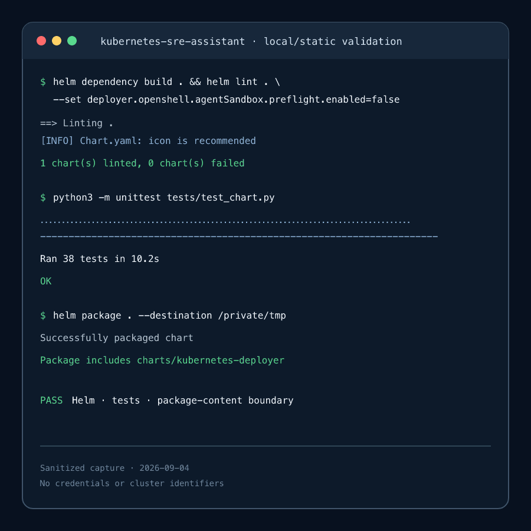
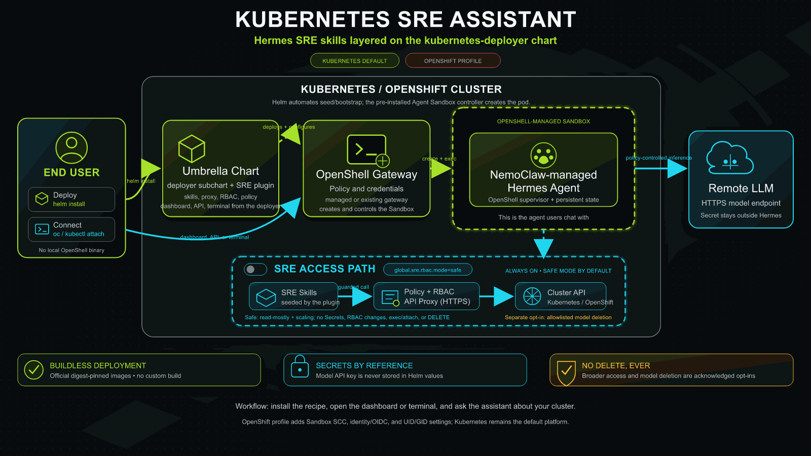

<!--
  SPDX-FileCopyrightText: Copyright (c) 2026 NVIDIA CORPORATION & AFFILIATES. All rights reserved.
  SPDX-License-Identifier: Apache-2.0
-->

# Kubernetes SRE Assistant

| Catalog field | Value |
| --- | --- |
| Description | Helps platform SREs inspect and scale Kubernetes or OpenShift workloads through a sandboxed Hermes agent whose cluster access flows only through a reviewed skill, an authenticated proxy, and RBAC with no delete verb, plus an opt-in controller that detects failures and applies tiered remediation. |
| Industry | ☁️ Cloud Services |
| Requirements | Kubernetes 1.33+ or OpenShift 4.20+ · Helm 3.14+ · Agent Sandbox controller · RWO StorageClass · model API-key Secret · privileged sandbox admission · repository clone for the kubernetes-deployer dependency |
| NemoClaw | N/A |
| Harness | Hermes 0.19.0 |
| OpenShell | 0.0.116 |
| Reviewed | 2026-09-04 |

An umbrella Helm chart that layers a Kubernetes SRE workflow onto the
[Kubernetes Deployer](../../../tools/kubernetes-deployer/README.md) tool. The
deployer runs the official NemoClaw-managed Hermes image behind an OpenShell
gateway; this recipe adds the reviewed `kubernetes-sre` skill, a bundled
OpenShift client, a policy-bounded HTTPS proxy in front of the cluster API, and
the RBAC that proxy uses. In the default `safe` mode the assistant can read
common non-secret resources cluster-wide and scale Deployments and
StatefulSets; it can never read Secrets, change RBAC, exec into Pods, or delete
anything. Broader no-delete access and the optional `openshift-llm-deploy`
model deployment skill are separate, acknowledged opt-ins. The chart consumes
the prebuilt managed image and never runs the NemoClaw CLI or bootstrap, hence
`NemoClaw: N/A`.

## Screenshot



This sanitized terminal capture shows the recipe's reproducible local validation
result. The exact commands and searchable expected output are preserved in
[Verification](#verification).

## Architecture



The deployer subchart (alias `deployer`) installs the OpenShell gateway, seeds
the retained Hermes state volume, creates the Sandbox, and publishes the Hermes
dashboard, OpenAI-compatible API, and terminal. This chart plugs into the
deployer's extension points:

```text
Hermes (sandbox) ── oc/kubectl + SRE_KUBECONFIG ──► HTTPS proxy (bearer token, private CA)
                                                        │ ServiceAccount, ClusterRole (no delete)
                                                        ▼
                                                  Kubernetes / OpenShift API
seed Job ── sre plugin: verify skill bundle, stage oc/kubectl, write kubeconfigs ──► state volume
```

- A **seed plugin** (`files/scripts/seed_sre.py`) runs inside the deployer's
  seed Job after the volume is claimed. It reassembles and verifies the skill
  archive, installs the skill trees read-only, stages the SHA-256-verified
  `oc`/`kubectl` binaries, and writes private kubeconfigs that point at the
  chart proxies.
- **Extra state mounts** present those files inside the sandbox as read-only
  subpaths under `/sandbox/.hermes` and `/chart-bin`.
- **Policy extensions** allow Hermes egress only to the exact proxy Service
  names, and a NetworkPolicy admits only Agent Sandbox Pods to the proxy ports.
- **Environment** tells the skill where the proxy and kubeconfig live.

## At A Glance

| Question | Answer |
| --- | --- |
| Category | NVIDIA Recipe |
| Contributor or provenance | NVIDIA |
| Use this when | A platform or SRE team wants a chat assistant that can answer cluster questions and perform bounded operations on Kubernetes or OpenShift without handing an agent a kubeconfig, cluster-admin, or delete rights. |
| You will get | Everything the Kubernetes Deployer provides (gateway, sandboxed Hermes, dashboard, API, terminal), plus the `kubernetes-sre` skill, a bundled OpenShift client, an authenticated cluster API proxy with `safe` or `broad-no-delete` RBAC, optional model deployment, metrics, and exact-resource model deletion, and an opt-in auto-heal controller that detects failure patterns and executes only allow-listed, risk-tiered remediations. |
| Runs on | Kubernetes 1.33+ or OpenShift 4.20+ with an Agent Sandbox controller and a ReadWriteOnce StorageClass. |
| Requires | Helm 3.14+, a clone of this repository (the deployer is a `file://` sibling dependency), privileged sandbox admission, a pre-created model API-key Secret, and the deployer's issuer-discovery decision. |
| Verified on | OpenShift 4.22.6 on amd64 with Kubernetes 1.35.5, Agent Sandbox controller v0.4.5, and OpenShell 0.0.116 (recipe 0.1.0 on deployer 0.4.0, safe mode, 2026-09-04). Also on a single-node kubeadm cluster, Kubernetes 1.36.2 on amd64 with Ubuntu 26.04 LTS and containerd 2.3.1, with the auto-heal controller in `assisted` mode (2026-09-11). |
| Evidence level | Live end-to-end for OpenShift safe mode: seed plugin log, skill and client mounts inside the sandbox, an authenticated read through the proxy, a denied DELETE, and a Hermes answer to a cluster question. Live on standard Kubernetes for install and for the auto-heal loop, including one executed rolling restart that resolved a stale-configuration crash loop and one correct escalation of an unfixable one. Local/static for `broad-no-delete`, model deployment, metrics, and deletion. |
| Support and maturity | Experimental with best-effort community support. See the repository [support policy](../../../../SUPPORT.md). |
| External access, data, and actions | Everything the deployer does, plus: downloads the checksum-pinned OpenShift client archive; creates a ClusterRole and ClusterRoleBinding for the proxy identity; sends cluster resource data returned through the proxy to the configured model endpoint. Safe mode can scale Deployments and StatefulSets. Opt-ins can create and patch workloads, read monitoring data, or delete allowlisted model resources. |
| Start here | [Quickstart](#quickstart) |
| Confirm success | [Verification](#verification) |

## Pinned release inputs

- Kubernetes Deployer chart `0.4.0` (sibling `file://` dependency): NemoClaw
  `v0.0.117` managed Hermes `0.19.0` image and OpenShell `0.0.116`, all as
  immutable digests; see its README for the full list
- OpenShift Client: `4.20.28`; official amd64 and arm64 archives are selected
  by node architecture and verified against pinned SHA-256 checksums
- Helper image: immutable multi-architecture Python digest for the proxies and
  the client stager; the recipe builds no image
- Skill bundle: one deterministic xz/tar archive of the two NVIDIA-authored
  skill trees, split into size-bounded ConfigMap chunks; its digest is pinned
  in `values.yaml` (`global.sre.bundle.sha256`) and joins the Sandbox
  configuration identity

For a cluster outside the documented client-version skew, override
`global.sre.cli.version` plus both architecture URLs and checksums together
with the matching official OpenShift Client release. The chart never accepts an
unverified archive.

## Quickstart

The deployer is referenced as `file://../../../tools/kubernetes-deployer`, so
install from a clone of this repository and materialize the dependency first.
All deployer values live under the `deployer` key; the recipe's own values live
under `global.sre`.

```bash
git clone https://github.com/NVIDIA/nemoclaw-community.git
cd nemoclaw-community/examples/recipes/nvidia/kubernetes-sre-assistant
helm dependency build .

kubectl create namespace sre-assistant
kubectl -n sre-assistant create secret generic model-api-key \
  --from-literal=api-key='<model-api-key>'

# Standard Kubernetes
helm upgrade --install sre . \
  --namespace sre-assistant \
  -f values-kubernetes.yaml \
  --set deployer.agent.model.name='<model-name>' \
  --set deployer.agent.model.baseUrl='https://model-endpoint.example/v1' \
  --wait --timeout 20m

# OpenShift (pre-create the namespace; Helm reads its SCC UID range)
helm upgrade --install sre . \
  --namespace sre-assistant \
  -f values-openshift.yaml \
  --set deployer.agent.model.name='<model-name>' \
  --set deployer.agent.model.baseUrl='https://model-endpoint.example/v1' \
  --wait --timeout 20m
```

Keep the release name at 40 characters or fewer and free of `api`, `key`,
`token`, `secret`, `password`, and `credential` segments; the chart derives
every resource name from it and NemoClaw rejects such segments inside the
sandbox environment. `values-kubernetes.yaml` and `values-openshift.yaml` are
the deployer profiles nested under `deployer`; they also carry the acknowledged
anonymous OIDC discovery binding the gateway needs (see the deployer README,
"Issuer discovery").

Helm NOTES prints the sandbox name, the port-forward and `gateway-token`
commands for the dashboard and API, and the terminal attach command when
`deployer.operatorClient.enabled=true`. Then ask, for example:

```text
Which Pods in sre-assistant are not Ready, and why?
Scale the deployment demo-api in team-a to 3 replicas.
```

The assistant inspects first, asks for confirmation before any change, and
refuses destructive requests with a human-reviewable command instead.

## What the assistant can do

### Safe mode (default)

`global.sre.rbac.mode=safe` grants the proxy identity read access to common
non-secret resources cluster-wide (Namespaces, Nodes, Pods and logs, Services,
Events, ConfigMaps, PVCs, workloads, Jobs, HPAs, Ingresses, Routes, KServe and
NIM resources, metrics) and write access only to the `/scale` subresource of
Deployments and StatefulSets. The proxy admits only `GET` and `PATCH`, and
additionally rejects Secret, ServiceAccount-token, exec, attach, port-forward,
pod-proxy, and node-proxy paths regardless of RBAC.

Hermes authenticates to the proxy with a random chart-managed bearer token
stored in retained state; the proxy's Kubernetes ServiceAccount token is
mounted only in the proxy Pod. Set `global.sre.proxy.authSecretRef.name` to
use an operator-provided Secret instead.

All sandbox-to-proxy traffic uses CA-verified HTTPS because Kubernetes clients
will not send bearer credentials to plaintext servers. By default Helm creates
and preserves a private CA plus a serving certificate covering the proxy
Service DNS names. Set `global.sre.proxy.tlsSecretRef.name` to use an
operator-managed `kubernetes.io/tls` Secret containing the configured
`ca.crt`, `tls.crt`, and `tls.key` keys. NemoClaw routes Hermes egress through
OpenShell's forward proxy; the recipe marks only its exact proxy Service
endpoints with OpenShell `tls: skip` so the private-CA session stays end to end.
OpenShell still enforces exact host, port, and binary policy, the proxy enforces
methods and paths, and NetworkPolicy limits the proxy ports to Agent Sandbox
Pods.

### Broader access

`-f values-broad-no-delete.yaml` (or `global.sre.rbac.mode=broad-no-delete`
with `I_ACKNOWLEDGE_CLUSTER_WIDE_NO_DELETE`) grants create, update, and patch
across API groups and lets the proxy admit `POST` and `PUT`. It still excludes
every delete verb and proxy `DELETE` request, and the proxy path denylist stays
in force. This mode can still cause outages or indirect privilege escalation
without DELETE; it is not recommended for production.

### Model deployment skill

`global.sre.openshiftLlmDeploy.enabled=true` requires `broad-no-delete` and
adds the `openshift-llm-deploy` skill, which deploys models with NVIDIA Dynamo
or plain vLLM using only operator-approved, digest-pinned images. The chart
references an existing Hugging Face token Secret by name and key; neither Helm
nor Hermes reads, copies, changes, or deletes that Secret, and the one-time
downloader receives the key only through `secretKeyRef` with no mounted
ServiceAccount token.

```yaml
global:
  sre:
    rbac:
      mode: broad-no-delete
      dangerousAcknowledgement: I_ACKNOWLEDGE_CLUSTER_WIDE_NO_DELETE
    openshiftLlmDeploy:
      enabled: true
      targetNamespace: models
      hfTokenSecretRef:
        name: hf-token
        key: HF_TOKEN
```

On OpenShift, a Dynamo workload may require `anyuid`. The skill reports the
exact human-run `oc adm policy add-scc-to-user` command after an admission
failure; the skill and chart never grant that SCC or `cluster-admin`.

Measured Prometheus/Thanos telemetry is another opt-in
(`global.sre.openshiftLlmDeploy.metrics.enabled=true`). It creates a separate
proxy identity that can issue only `GET` to the configured monitoring Service's
`query`/`query_range` paths. On OpenShift that identity receives the built-in
read-only `cluster-monitoring-view` role and trusts the injected service CA.
Standard Kubernetes clusters must point the values at a compatible HTTPS
Prometheus Service and set `metrics.caConfigMapRef.name` when its certificate is
not anchored in the helper image's system roots.

Namespace-scoped model deletion is a separate opt-in under
`global.sre.openshiftLlmDeploy.deletion`. It requires the exact namespace,
`I_ACKNOWLEDGE_NAMESPACE_MODEL_DELETE`, and at least one exact
`apiGroup`/plural `resource`/`name` tuple in `allowedResources`. Every delete
RBAC rule uses Kubernetes `resourceNames`; namespace scope is never treated as
ownership. PVCs additionally require `deletePVCs=true`. Secret deletion is
always rejected and no cluster-scoped delete is granted.

```yaml
global:
  sre:
    openshiftLlmDeploy:
      deletion:
        enabled: true
        namespace: models
        dangerousAcknowledgement: I_ACKNOWLEDGE_NAMESPACE_MODEL_DELETE
        allowedResources:
          - apiGroup: serving.kserve.io
            resource: inferenceservices
            name: my-model
```

## Autonomous remediation (opt-in)

The assistant above is interactive: a human asks, Hermes answers. The vendored
`sre-autoheal-agent` subchart adds the other half, a controller that watches
the cluster and acts without being asked. It is off by default; with
`autoheal.enabled=false` nothing renders.

It detects crash loops, pending pods, stuck terminations, stalled rollouts,
pending claims and not-ready nodes, asks an OpenAI-compatible model for a
diagnosis, then consults a policy engine before doing anything. Actions are
allow-listed and tiered:

| Tier | Actions | Behaviour in `assisted` mode |
| --- | --- | --- |
| SAFE | restart pod, rollout restart, delete evicted pods, notify only | executed automatically |
| MEDIUM | rollout undo, scale, bump memory limit, force delete pod, cordon, uncordon | only with an approval annotation on that workload |
| NEVER_AUTO | drain, approve CSR, fix image, probe, storage or config, grant RBAC, control-plane work | always escalated to a human |

Namespace scope, an opt-out label, flap detection, a cooldown, and per-cycle
and per-hour budgets apply on top. Policy mode is `observe`, `safe` or
`assisted`, and any mode that can act requires
`autoheal.dangerousAcknowledgement=I_ACKNOWLEDGE_CLUSTER_REMEDIATION`.
RBAC is a separate `read-only`, `safe` or `safe+nodes` profile, and a
remediating mode on a `read-only` role is refused at render time.

```bash
helm upgrade --install sre . -n nemoclaw-sre-assistant \
  -f values-kubernetes.yaml \
  --set autoheal.enabled=true \
  --set autoheal.llm.baseUrl='https://model-endpoint.example/v1' \
  --set autoheal.llm.model='<model-name>' \
  --set autoheal.agentConfig.policy.mode=assisted \
  --set autoheal.dangerousAcknowledgement=I_ACKNOWLEDGE_CLUSTER_REMEDIATION
```

Umbrella charts pass static subchart values, so the diagnosis endpoint cannot
be derived from `deployer.agent.model`; set it explicitly. Start at
`mode=observe` on a cluster you share. Watch what it decides with:

```bash
kubectl -n nemoclaw-sre-assistant logs deploy/<release>-autoheal -f
```

Every decision is recorded in the release's memory ConfigMap, which also drives
the learning that promotes or demotes an action for a recurring fingerprint.

The controller reloads file-backed Kubernetes API tokens before each request,
so projected ServiceAccount token rotation does not require a restart. If the
file cannot be read or is empty, the request fails without reusing an old token.
An explicitly configured token value takes precedence over a token file.

Failed-Pod cleanup is limited to the Pods recorded in the approved finding;
it does not clean unrelated workloads in the same namespace. Pods that are no
longer in an eligible failed state are left unchanged.

Treat the release namespace as privileged. The agent's Python source is
mounted from a ConfigMap, so anyone who can edit ConfigMaps there can run code
with the agent's cluster-wide rights; the agent's own Role cannot modify that
ConfigMap. Pod log tails shown to the model are always credential-redacted and
are never written to the memory ConfigMap. `autoheal.llm.redactLogs=true` goes
further and omits them from the prompt entirely. A model-suggested pod name is
honoured only when it belongs to the failing workload, so text inside a
container's logs cannot redirect a restart to another pod.

## Skill bundle and seeding

The two skill trees under `files/skills/` are packaged by
`scripts/build-sre-skills-bundle.py` into one deterministic archive with a
manifest, split into ConfigMap chunks, and pinned by digest in `values.yaml`.
The builder injects the same cluster-safety contract into every packaged
`SKILL.md`; the source files stay reviewable and unmodified. Rendering fails
when `global.sre.bundle` disagrees with the committed files, so rebuild after
any skill change:

```bash
python3 scripts/build-sre-skills-bundle.py
```

The seed plugin reassembles the chunks in memory, rejects links, traversal,
unexpected roots, binary or cache artifacts, and digest mismatches, then stages
the trees at mode `0555` on the retained state volume. Changing the bundle
changes the Sandbox configuration identity, so an existing Sandbox must be
retired first (see [Teardown](#teardown)) and the upgrade run with
`deployer.lifecycle.seed.runOnUpgrade=true` and
`deployer.lifecycle.seed.dangerousAcknowledgement=I_ACKNOWLEDGE_SANDBOX_STOPPED`.

## Verification

**Evidence level:** contributor-reported live runs for OpenShift safe mode and
standard Kubernetes, as listed above. Model deployment, metrics, and deletion
have local/static coverage only. The token-rotation and cleanup-scope fixes
have local regression coverage; they were not re-tested on a live cluster.

The 0.1.0 evaluation on OpenShift 4.22.6 (safe mode, cluster-local model
endpoint) confirmed:

- `helm dependency build` followed by `helm upgrade --install ... -f values-openshift.yaml --wait`
  completes; the deployer seed Job log shows the `sre` plugin verifying the
  bundle, staging `oc` and `kubectl`, and writing the proxy kubeconfig.
- Inside the sandbox `/sandbox/.hermes/skills/kubernetes-sre/SKILL.md`,
  `/chart-bin/oc`, and `/sandbox/.hermes/sre-kubeconfig` are present read-only.
- `oc --kubeconfig "$SRE_KUBECONFIG" get pods -n <release namespace>` succeeds
  through the proxy, while `oc delete pod` through the same kubeconfig is
  refused by the proxy with `MethodNotAllowed` and `oc get secrets` is refused
  with `Forbidden`.
- `hermes --skills kubernetes-sre chat -q` asked which Pods run in the
  namespace and answered with the live Pod names followed by the requested
  `SRE_AGENT_OK` marker (two tool calls, four seconds).
- The deployer teardown sequence (`deployer.lifecycle.sandbox.desiredState=absent`)
  removed the Sandbox through the gateway, and the following `present`
  revision recreated it.

Run the local/static checks from this recipe directory:

```bash
helm dependency build .
helm lint . --set deployer.openshell.agentSandbox.preflight.enabled=false \
  --set deployer.platform.serviceAccountIssuerDiscovery.preexistingAnonymousAccess=true
python3 -m unittest discover -s tests -p 'test_*.py'
python3 scripts/build-sre-skills-bundle.py
python3 ../../../../scripts/check_license_headers.py --check
helm template test . -f values-kubernetes.yaml --api-versions agents.x-k8s.io/v1alpha1 >/tmp/rendered.yaml
```

**Expected result:**

```text
Ran 53 tests
OK
```

**This verifies:** dependency wiring, the seed plugin contract and its
ownership behavior, bundle integrity, the proxy's method and path policy,
RBAC guardrails for every mode, acknowledgements for the opt-ins, package
contents, file-backed API token rotation, finding-scoped failed-Pod cleanup,
and that the deployer alone carries no SRE material.

**These local checks do not verify:** live token rotation or cleanup,
`broad-no-delete` mode, model deployment, metrics, or deletion against a live
cluster, production scale, or availability.

## Teardown

Use the deployer's helm-driven sequence; only `helm` and `kubectl`/`oc` are
needed. Deleting the Sandbox ends its active Hermes sessions.

```bash
helm upgrade sre . --namespace sre-assistant --reuse-values \
  --set deployer.lifecycle.sandbox.desiredState=absent \
  --set deployer.lifecycle.sandbox.dangerousAcknowledgement=I_ACKNOWLEDGE_SANDBOX_DELETE \
  --wait --timeout 10m
kubectl -n sre-assistant get sandbox    # expect NotFound
helm uninstall sre --namespace sre-assistant
```

The retained Hermes state, gateway, and `nemoclawHome` PVCs, the proxy
credential Secret, and the private CA Secret stay behind by design; inventory
and delete them separately. The proxy ClusterRole and ClusterRoleBinding are
Helm-owned and removed by `helm uninstall`.

## Known Limitations

- Everything listed for the [Kubernetes Deployer](../../../tools/kubernetes-deployer/README.md#known-limitations).
- The recipe requires the chart-managed OpenShell gateway; existing-gateway
  mode is rejected because the sandbox must reach namespace-local proxies.
- The `file://` dependency needs a repository clone and `helm dependency build`;
  the recipe is not published as a standalone package.
- Release names are limited to 40 characters so every derived name fits.
- `broad-no-delete` can still cause outages or indirect privilege escalation
  and is not recommended for production.
- The model deployment skill, metrics proxy, and model deletion have render and
  unit coverage but were not exercised live by this contribution.

## Provenance and Support

This NVIDIA-authored recipe layers NVIDIA-authored skills onto the
NVIDIA-authored Kubernetes Deployer tool and the official NemoClaw, Hermes, and
OpenShell release artifacts without building custom images. It is experimental
and provided with best-effort community support under the repository
[support policy](../../../../SUPPORT.md).

The `charts/sre-autoheal-agent` subchart is vendored, not fetched. It is an
NVIDIA-authored chart whose upstream lives in the `hermes-nemo-skills`
repository under
`skills/operations/infrastructure/sre/sre-autoheal-agent`. The vendored copy
keeps its own Apache-2.0 SPDX headers. Local source changes reload file-backed
Kubernetes API tokens and limit failed-Pod cleanup to the current finding.
Through this recipe's values, the agent container image is repinned from the subchart's
mutable `3.12-slim` tag to the same immutable digest this recipe already uses
elsewhere. The agent is pure Python standard library and installs nothing at
start-up.

## Third-Party Dependencies

See this recipe's [third-party notices](THIRD-PARTY-NOTICES), the deployer's
[third-party notices](../../../tools/kubernetes-deployer/THIRD-PARTY-NOTICES),
and the repository [third-party notices](../../../../THIRD-PARTY-NOTICES) for
upstream licenses, versions, immutable artifacts, and local modifications.
