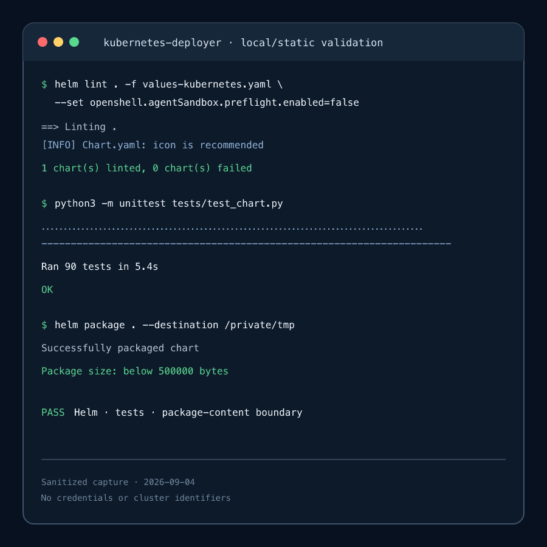
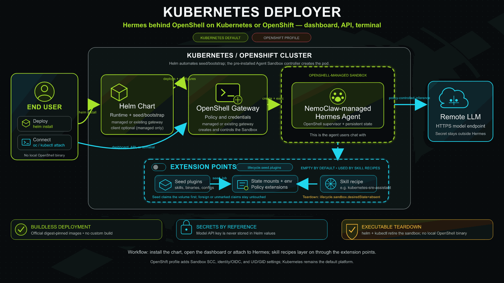

<!--
  SPDX-FileCopyrightText: Copyright (c) 2026 NVIDIA CORPORATION & AFFILIATES. All rights reserved.
  SPDX-License-Identifier: Apache-2.0
-->

# Kubernetes Deployer

| Catalog field | Value |
| --- | --- |
| Description | Deploys the official NemoClaw-managed Hermes image behind an OpenShell gateway on Kubernetes or OpenShift, with the Hermes dashboard, OpenAI-compatible API, and terminal access, plus extension points that skill recipes build on. |
| Industry | ✨ Other |
| Requirements | Kubernetes 1.33+ or OpenShift 4.20+ · Helm 3.14+ · Agent Sandbox controller · RWO StorageClass · model API-key Secret · privileged sandbox admission · anonymous OIDC discovery decision |
| NemoClaw | N/A |
| Harness | Hermes 0.19.0 |
| OpenShell | 0.0.116 |
| Reviewed | 2026-09-04 |
| Upstream | https://github.com/NVIDIA/NemoClaw |

A buildless Helm chart that runs the official NemoClaw-managed Hermes image
through the official OpenShell gateway on Kubernetes or OpenShift. It is a
deployment utility, not an agent workflow: it does not invoke the NemoClaw CLI
or bootstrap (hence `NemoClaw: N/A` above), and it ships no skills of its own.
It delivers the access surfaces the
[NemoClaw Hermes quickstart](https://docs.nvidia.com/nemoclaw/user-guide/hermes/get-started/quickstart)
gives a workstation user: the Hermes dashboard on port `18789`, the
OpenAI-compatible API on port `8642`, the API bearer token (`gateway-token`),
and a terminal session (`launch`/`connect`). Recipes such as
[Kubernetes SRE Assistant](../../recipes/nvidia/kubernetes-sre-assistant/README.md)
layer skills, credentials, and policy onto this chart through its extension
points. It does not include the third-party Hermes WebUI, SkillSpector, or
NemoClaw recipe delivery.

## Screenshot



This sanitized terminal capture shows the chart's reproducible local validation
result. The exact commands and searchable expected output are preserved in
[Verification](#verification).

## Architecture



Helm installs the OpenShell gateway, seeds the retained Hermes state volume,
and runs a bootstrap Job that asks OpenShell to create and confine the
NemoClaw-managed Hermes Sandbox. The end user reaches Hermes through the
dashboard, the API, or the in-cluster terminal client.

The access relay is a small Deployment that runs the pinned OpenShell CLI's
`openshell forward service` (a gateway gRPC stream, no SSH) against the
sandbox's loopback dashboard and API listeners and publishes them on a
ClusterIP Service. This is the in-cluster equivalent of the
`openshell forward start` the `nemohermes` CLI runs on a workstation. Browser
exposure through an OpenShift Route adds an OpenShift `oauth-proxy` login and a
same-origin nginx edge in the same Pod.

```text
browser / API client
  └─ Route or Ingress (optional) ─► oauth-proxy (OpenShift) ─► nginx edge ─┐
                                                                            ▼
kubectl port-forward ───────────────────────────────► access relay (openshell forward service)
                                                                            │ gRPC via gateway
                                                             OpenShell gateway ─► supervisor
                                                                            │
                                     Hermes dashboard 127.0.0.1:18789 / API 127.0.0.1:8642
                                            (NemoClaw-managed Hermes sandbox)
```

## At A Glance

| Question | Answer |
| --- | --- |
| Category | Developer Tool |
| Contributor or provenance | NVIDIA |
| Use this when | A Kubernetes or OpenShift operator wants the NemoClaw-managed Hermes agent running behind OpenShell without building an image or installing a local chat client, or wants a base for a skill recipe. |
| You will get | An OpenShell gateway, a sandboxed Hermes agent, the Hermes dashboard and OpenAI-compatible API (port-forward by default, Route/Ingress/NodePort optional), optional in-cluster terminal chat, an executable sandbox teardown, and extension points for seed plugins, state mounts, policy, and skills. |
| Runs on | Kubernetes 1.33+ or OpenShift 4.20+ with an Agent Sandbox controller and a ReadWriteOnce StorageClass. |
| Requires | Helm 3.14+, privileged sandbox admission, a pre-created model API-key Secret, and a decision about anonymous OIDC discovery (`values-kubernetes.yaml` or `values-openshift.yaml`). |
| Verified on | OpenShift 4.22.6 on amd64 with Kubernetes 1.35.5, Agent Sandbox controller v0.4.5, and OpenShell 0.0.116 (chart 0.4.0, Route exposure with oauth-proxy, 2026-09-04). Also on a single-node kubeadm cluster, Kubernetes 1.36.2 on amd64 with Ubuntu 26.04 LTS, containerd 2.3.1, Calico, `local-path` storage, the same Agent Sandbox controller v0.4.5, and ClusterIP exposure (2026-09-08). |
| Evidence level | Live end-to-end on both platforms: install, dashboard, `gateway-token`, `/v1/models` (401 without a token, 200 with one), a chat completion, the helm-driven sandbox teardown and recreation, and clean removal of the cert-generation hook RBAC. The standard-Kubernetes run additionally exercised the anonymous OIDC discovery probe against a kubeadm ServiceAccount issuer. |
| Support and maturity | Experimental Kubernetes deployment path with best-effort community support. See the repository [support policy](../../../SUPPORT.md). |
| External access, data, and actions | Pulls pinned images from public registries and downloads the checksum-pinned OpenShell CLI archive. Sends prompts to the configured model endpoint and may incur provider cost. Installation creates workloads, RBAC, NetworkPolicies, and retained PVCs, and optionally one ClusterRoleBinding that lets unauthenticated callers read the cluster's OIDC discovery document and public signing keys. |
| Start here | [Prerequisites](#prerequisites) |
| Confirm success | [Verification](#verification) |

## Pinned release inputs

- NemoClaw/Hermes managed image: NemoClaw `v0.0.117`, Hermes `0.19.0`, immutable
  multi-architecture index digest in `values.yaml`. The chart consumes this
  prebuilt image; it never runs the NemoClaw CLI or bootstrap.
- OpenShell chart and CLI: `v0.0.116`; the dependency is vendored with narrow
  OpenShift dual-CA and UID-isolation template fixes and a hook-lifecycle fix
  for its cert-generation Job, while gateway and supervisor images remain
  official immutable multi-architecture index digests
- Helper image: immutable multi-architecture Python digest; the chart builds no
  relay or bootstrap image
- Optional dashboard edge: immutable multi-architecture `nginxinc/nginx-unprivileged`
  digest, used only when `access.exposure.type` is not `none`
- Optional OpenShift dashboard login: `quay.io/openshift/origin-oauth-proxy:4.20`
  immutable digest (linux/amd64 manifest); override it with the cluster's
  release-payload `oauth-proxy` image on other architectures

No Dockerfile or image build is part of installation.

Hermes `0.21.0` is the newer standalone upstream release, but the latest
published NemoClaw-managed Hermes image remains `v0.0.117` with Hermes `0.19.0`.
The chart intentionally chooses that latest compatible managed image rather
than creating an unverified custom image or substituting a generic Hermes
container that lacks the NemoClaw/OpenShell runtime contract.

## Prerequisites

- Kubernetes 1.33+ or OpenShift 4.20+ with a `ReadWriteOnce` StorageClass; set `persistence.storageClass` when the cluster has no default
- Agent Sandbox CRD/controller serving `agents.x-k8s.io/v1alpha1` or `v1beta1`
- Helm 3.14+
- A model API key in a pre-created Secret; the key must not be placed in values or Helm command history
- Admission policy that permits the OpenShell combined-supervisor Sandbox. On
  standard Kubernetes this commonly requires an operator-prepared namespace
  with an appropriate privileged Pod Security Admission or equivalent policy;
  the chart deliberately does not create or relabel namespaces.
- A decision about OIDC issuer discovery, made explicit by the platform profile
  you install with (see [Issuer discovery](#issuer-discovery)).

```bash
kubectl create namespace nemoclaw-hermes
kubectl label namespace nemoclaw-hermes \
  pod-security.kubernetes.io/enforce=privileged \
  pod-security.kubernetes.io/audit=privileged \
  pod-security.kubernetes.io/warn=privileged
kubectl -n nemoclaw-hermes create secret generic model-api-key \
  --from-literal=api-key='<model-api-key>'
helm upgrade --install nemoclaw-hermes . \
  --namespace nemoclaw-hermes \
  -f values-kubernetes.yaml \
  --set agent.model.name='<model-name>' \
  --set agent.model.baseUrl='https://model-endpoint.example/v1' \
  --wait --timeout 20m
```

The privileged Pod Security Admission labels are the standard-Kubernetes
equivalent of the SecurityContextConstraint that `values-openshift.yaml`
requests, and the chart never sets them itself. Omit them on OpenShift.

> **Helm 4 users:** drop `--wait` from the first install and from the teardown
> upgrade below, then check readiness with `kubectl -n <namespace> get pods`.
> Helm 4.2.1 blocks for the whole timeout whenever a hook carries
> `helm.sh/hook-delete-policy: before-hook-creation` and the resource does not
> exist yet: it logs `ignoring delete failure ... not found`, then waits for
> that deletion anyway. The cert-generation hook hits this on a clean
> namespace. Helm 3.16 completes the same install in under a second, so the
> annotations are correct and this is a Helm 4 regression.

The bootstrap Job first verifies that the gateway's anonymous OIDC discovery
path works, then registers the credential with OpenShell, configures
`inference.local`, and asks OpenShell to create the Sandbox. The real key
remains in the Kubernetes Secret/OpenShell credential path; Hermes receives only
the managed inference sentinel.

HTTPS model endpoints are required by default. A plain HTTP endpoint is accepted
only when `agent.model.allowInsecureHttp=true` and
`agent.model.insecureHttpAcknowledgement=I_ACKNOWLEDGE_PLAINTEXT_MODEL_CREDENTIALS`;
that mode can expose the model credential on the network.

## In-cluster Hermes chat (no local OpenShell binary)

Set `operatorClient.enabled=true` during installation or upgrade to create one
attach-only in-cluster client for the existing OpenShell-managed Hermes
Sandbox. The client downloads the pinned OpenShell release artifact in an init
container, verifies its SHA-256 digest, and always starts the fixed
`openshell sandbox exec ... hermes` command. It does not contain Hermes,
NemoClaw, or model credentials itself. `operatorClient.skills` lists the Hermes
skills the session activates; recipes set it.

```bash
helm upgrade --install nemoclaw-hermes . \
  --namespace nemoclaw-hermes \
  --set operatorClient.enabled=true \
  --reuse-values \
  --wait --timeout 20m

oc -n nemoclaw-hermes attach -it \
  statefulset/nemoclaw-hermes-kubernetes-deployer-operator-client \
  -c hermes-chat
```

The equivalent Kubernetes command is `kubectl attach`. Helm prints the exact
StatefulSet name for the release because long release names are truncated.
`oc attach` does not provide a detach-key option. To disconnect without ending
Hermes, close only the local terminal or terminate only the local `oc` process;
the client Pod continues running. `Ctrl-C` ends the current Hermes session, and
the client immediately starts a fresh session for the next attach.

Assign each client to one trusted operator at a time. One StatefulSet exposes
one persistent Hermes TTY, so do not share it among mutually untrusted users;
use a separate release/client identity per user when session isolation is
required.

The chart does not grant end-user RBAC. A user who is not already a namespace
administrator needs only `get` on `pods` and `create` on `pods/attach` for this
namespace. Do not grant `pods/exec`: attach is intentionally limited to the
fixed client process, while exec would let a user invoke arbitrary binaries in
the client container. Keep the release in a namespace where untrusted users
cannot create workloads or spoof chart pod labels.

The client uses a rotating, short-lived ServiceAccount token with only the
OpenShell user audience. A separate Pod-bound token is minted only inside the
bootstrap Job for lifecycle administration; the client refuses to start if
its token includes that admin audience. The feature is supported only with the
chart-managed gateway, where bootstrap can create the scoped workspace
membership.

## NemoClaw dashboard and API (quickstart parity)

The NemoClaw quickstart ends with `nemohermes my-hermes dashboard-url`,
`http://127.0.0.1:8642/v1`, and `nemohermes my-hermes gateway-token`. The
chart-managed access relay (`access.enabled=true` by default) provides the same
surfaces without a workstation-side OpenShell binary. It stages the pinned
OpenShell CLI in an init container, authenticates with a projected
ServiceAccount token that carries only the OpenShell user audience, waits for
the sandbox to become Ready, and keeps one `openshell forward service` gRPC
stream per port alive. The bootstrap Job grants that identity workspace-user
membership and revokes it when the relay is disabled.

| NemoClaw CLI on a workstation | This chart on Kubernetes or OpenShift |
| --- | --- |
| `nemohermes my-hermes status` | `kubectl -n <ns> get sandbox default--<sandbox>` or `kubectl -n <ns> exec deploy/<release>-...-access -c relay -- /tools/nemoclaw-access status` |
| `nemohermes my-hermes logs --follow` | `kubectl -n <ns> logs pod/default--<sandbox> -c agent --follow` |
| `nemohermes my-hermes dashboard-url` | `kubectl -n <ns> port-forward svc/<release>-...-access 18789:18789 8642:8642`, then `http://127.0.0.1:18789/`; or the Route/Ingress URL printed by Helm NOTES |
| `http://127.0.0.1:8642/v1` | same URL after the port-forward, or the API Route/Ingress URL |
| `nemohermes my-hermes gateway-token --quiet` | `kubectl -n <ns> exec deploy/<release>-...-access -c relay -- /tools/nemoclaw-access gateway-token --quiet` |
| `nemohermes launch my-hermes` / `connect` | `kubectl -n <ns> attach -it statefulset/<release>-...-operator-client -c hermes-chat` with `operatorClient.enabled=true` |
| `nemohermes inference set` | change `agent.model.*` and upgrade; the bootstrap Job reconciles the provider and route. Because the model is part of the Sandbox configuration identity, retire the existing Sandbox first (see [Teardown](#teardown)) |
| `nemohermes delete my-hermes` | `helm upgrade ... --set lifecycle.sandbox.desiredState=absent ...` (see [Teardown](#teardown)) |

Helm NOTES prints the exact commands and URLs for the release. The relay
becomes Ready as soon as its credentials are staged; the forwarded ports start
accepting connections once OpenShell reports the Sandbox Ready. The
`gateway-token` helper reads Hermes' minted `API_SERVER_KEY` from the
sandbox-owned `.env` through the authenticated exec API, exactly as the
NemoClaw CLI does, and the caller therefore needs `pods/exec` on the relay Pod.
Treat that permission like OpenShell sandbox access.

### Exposure modes

`access.exposure.type` selects how the two surfaces leave the Pod network:

- `none` (default): ClusterIP only. Use `kubectl port-forward`, which mirrors
  the quickstart's loopback model and needs no acknowledgement.
- `route` (OpenShift): one Route per surface. The dashboard Route re-encrypts
  to an `oauth-proxy` sidecar that requires an OpenShift login and, by default,
  `get` on the release's access Service (`access.exposure.route.oauthProxy.subjectAccessReview`
  overrides the SubjectAccessReview). The API Route is edge-terminated because
  Hermes authenticates every API call with its own bearer key. Supply
  `access.exposure.route.appsDomain` or explicit hosts; see
  [`values-access-route.yaml`](values-access-route.yaml).
- `ingress` and `nodePort` (Kubernetes): publish the nginx edge ports. Neither
  adds a login.

Hermes `0.19` trusts its loopback dashboard without any authentication and
rejects non-loopback `Host` and WebSocket `Origin` headers. Any exposure other
than `none` therefore runs a pinned unprivileged nginx edge in the relay Pod
that first enforces same-origin browser requests (an `Origin` header must match
the `Host` the browser used, otherwise `403`) and then presents the loopback
`Host`/`Origin` values Hermes expects. Publishing the dashboard without a login
(`ingress`, `nodePort`, or `route` with `oauthProxy.enabled=false`) requires
`access.exposure.dashboardUnauthenticatedAcknowledgement=I_ACKNOWLEDGE_UNAUTHENTICATED_DASHBOARD`
and is appropriate only behind an operator-managed authenticating proxy or on
a private network. The API surface always requires the Hermes bearer key.

### Keeping the OpenAI-compatible API undrained

NemoClaw's Hermes gateway consults a cron-restore gate before it accepts an
agent turn. That gate opens `/sandbox/.nemoclaw` and requires a root-owned
directory without group or world write; any other posture "fails toward
keeping dispatch drained", and `/v1/chat/completions` answers `503
gateway_draining` forever while `/health` and `/v1/models` keep working.
OpenShell's Kubernetes driver chowns the whole `/sandbox` tree to the injected
sandbox UID, so the stock image never satisfies that gate on Kubernetes or
OpenShift. The chart therefore creates a small claim
(`agent.nemoclawHome`, 100Mi by default), prepares it once per install or
upgrade with a root Job that runs under the sandbox ServiceAccount (chown
`0:0`, mode `0755`, SELinux label `container_file_t:s0` without MCS categories
so every sandbox Pod can read it), and mounts it read-only at
`/sandbox/.nemoclaw`. Nothing inside the sandbox writes there; NemoClaw's
host-side snapshot and cron-restore tooling is not part of this chart. Set
`agent.nemoclawHome.enabled=false` to skip the volume and the root Job; the
dashboard chat and the terminal keep working because they run the agent
locally instead of through the gateway.

### Ports and the sandbox environment

The managed image already listens on `18789` and `8642`, so the defaults add no
environment to the Sandbox and leave the configuration identity of existing
releases unchanged. `access.dashboard.port` other than `18789` sets
`NEMOCLAW_DASHBOARD_PORT`; `access.api.port` must stay within NemoClaw's
`8642`-`8652` range and sets `NEMOCLAW_HERMES_API_PORT` when changed. Route and
Ingress exposure (or an explicit `access.dashboard.externalUrl`) record the
browser-facing origin as `CHAT_UI_URL`, the variable the NemoClaw CLI uses for
the same purpose. These variables are chart-managed and rejected in `agent.env`.
Changing them changes the Sandbox configuration identity, so an upgrade fails
closed until the existing Sandbox is retired (see [Teardown](#teardown)).

Kubernetes injects `<SERVICE>_SERVICE_HOST`, `_SERVICE_PORT`, and
`_SERVICE_PORT_<PORTNAME>` variables for every Service in the namespace into
the sandbox Pod, and NemoClaw refuses to start Hermes when any variable name
carries a `TOKEN`, `KEY`, `SECRET`, `PASSWORD`, `CREDENTIAL`, or `API`
segment. The chart therefore names its Service ports `dashboard`,
`openai`, `edge-dashboard`, `edge-openai`, and `oauth-https`, rejects
`agent.env` names with such segments, and fails to render for a release name
that contains one (for example `hermes-api`). Keep unrelated Services with such
names out of the sandbox namespace as well.

The relay's projected token defaults to one hour (`access.relay.tokenExpirationSeconds`).
Shortly before expiry it reloads the rotated token and restarts the two forward
streams; open dashboard sessions reconnect automatically.

## Extension points for skill recipes

The chart holds no skills. A recipe (typically an umbrella chart that depends on
this one, such as [Kubernetes SRE Assistant](../../recipes/nvidia/kubernetes-sre-assistant/README.md))
adds them through these values, each rendered with Helm's `tpl` so the recipe
can reference `.Release.Name`, `.Release.Namespace`, and this chart's values
from static subchart values:

| Value | Purpose |
| --- | --- |
| `lifecycle.seed.plugins` | Seed plugins: a ConfigMap with a Python entrypoint that runs inside the seed Job after the core claim, plus optional init containers, env, volumes, and mounts. Each plugin's `identity` (for example a skill-bundle digest) joins the Sandbox configuration identity. |
| `agent.extraStateMounts` | Read-only subpaths of the retained state volume presented inside the sandbox (skills, kubeconfigs, staged binaries). Never `/sandbox/.hermes` itself or the chart-managed `workspace` and `.nemoclaw` mounts. |
| `agent.env` and `agent.envTemplate` | Non-secret sandbox environment; the template form renders to the same map and exists because Helm cannot replace a structured subchart default with a string. |
| `policy.readOnlyPaths`, `policy.networkPolicies`, `policy.networkPoliciesTemplate` | Additional OpenShell filesystem read-only paths and named egress policies merged structurally into `files/policy.yaml`. |
| `operatorClient.skills` | Hermes skills activated for the terminal session. |

The seed Job runs plugins only after it has claimed the state volume for this
release, so a plugin never touches a volume owned by another release. A plugin
failure leaves the ownership marker at `seeding`, which lets the same release
retry and keeps the bootstrap Job from creating a Sandbox on half-seeded state.
List and map extension values also accept template-text forms so a recipe can
emit entries conditionally.

## Platform selection

Kubernetes is the default. It pins UID/GID `1000` for the gateway and chart Jobs and renders no OpenShift SCC references.

Kubernetes user namespaces remain an operator opt-in through
`openshell.server.enableUserNamespaces=true`; use it only when Kubernetes
1.33+, the container runtime, kernel, storage driver, and GPU/runtime choices
all support that mode. The portable default is `false`.

OpenShift is explicit and deterministic. The supplied profile is the atomic
platform switch: it sets `platform.openshift.enabled=true` and all required
OpenShift overrides together.

```bash
helm upgrade --install nemoclaw-hermes . \
  --namespace nemoclaw-hermes \
  -f values-openshift.yaml \
  --wait --timeout 20m
```

`values-openshift.yaml` sets `platform.openshift.enabled=true`, removes the
portable UID/GID `1000`, grants anonymous issuer discovery (below), and
explicitly acknowledges a RoleBinding from only the generated sandbox
ServiceAccount to `system:openshift:scc:privileged`. The chart never grants
`cluster-admin`. Set `createPrivilegedSccBinding=false` only when an operator
has pre-provisioned the equivalent SCC grant. Rendering fails if the OpenShift
profile is selected but `security.openshift.io/v1` is unavailable.

### Issuer discovery

The managed gateway validates bootstrap and client tokens against the cluster's
ServiceAccount issuer (`openshell.server.oidc.issuer`, default
`https://kubernetes.default.svc`). OpenShell 0.0.116 resolves that issuer by
fetching `/.well-known/openid-configuration` and the advertised JWKS with an
anonymous HTTP client. Standard Kubernetes serves neither endpoint to
unauthenticated callers, and stock OpenShift serves only the discovery
document, so without a decision the gateway can never initialize
authentication. Rendering therefore fails for the in-cluster issuer until one
of these is set:

- `platform.serviceAccountIssuerDiscovery.createPublicBinding=true` with
  `dangerousAcknowledgement=I_ACKNOWLEDGE_PUBLIC_OIDC_DISCOVERY`: bind the
  built-in `system:service-account-issuer-discovery` ClusterRole (issuer
  metadata and public signing keys, nothing else) to `system:unauthenticated`.
  `values-kubernetes.yaml` and `values-openshift.yaml` do this.
- `platform.serviceAccountIssuerDiscovery.preexistingAnonymousAccess=true`:
  the cluster already exposes both endpoints anonymously, or the issuer is an
  external provider that publishes them.

In both cases the bootstrap Job fetches the discovery document and JWKS without
credentials before it waits for the gateway, and fails with the remediation
text when either returns `401` or `403`. That turns a silent gateway start-up
failure into an actionable install error.

The issuer value must equal the string the cluster publishes, because OpenShell
compares them exactly. OpenShift publishes `https://kubernetes.default.svc`,
which is the chart default, but a default `kubeadm` cluster publishes
`https://kubernetes.default.svc.cluster.local` and the gateway then exits with
`OIDC discovery issuer mismatch`. Read the real value and pass it when it
differs:

```bash
kubectl get --raw /.well-known/openid-configuration | python3 -c 'import json,sys; print(json.load(sys.stdin)["issuer"])'
helm upgrade --install nemoclaw-hermes . -n nemoclaw-hermes -f values-kubernetes.yaml \
  --set openshell.server.oidc.issuer=https://kubernetes.default.svc.cluster.local
```

The render-time guard recognises both in-cluster issuer spellings above. Keep
the platform profile on the command line when overriding the issuer.

The OpenShift profile keeps user namespaces disabled and uses OpenShell's SCC
range resolution instead. Combining two UID-mapping mechanisms with retained
CSI subpath mounts is rejected at render time.

For a managed OpenShift gateway, the chart deliberately uses three IDs from the
release Namespace's SCC range: range start for short-lived lifecycle/proxy
workloads, start plus one for the gateway, and start plus two for the seed Job
and Hermes Sandbox. The official NemoClaw entrypoint retains its
`RLIMIT_NPROC=512` boundary, while Linux process accounting cannot combine the
gateway's threads with Hermes under one host UID. Helm reads the range from the
pre-created Namespace's `openshift.io/sa.scc.uid-range` annotation; therefore,
create the Namespace before installation and leave both
`openshell.server.openshift.gatewayUid.value=null` and
`openshell.server.openshift.sandboxUid.value=null` for live installs. The explicit
values exist only for deterministic offline rendering and must be set together
to distinct, namespace-valid IDs. Existing-gateway mode does not inject a local
UID into the external gateway's driver configuration. Kubernetes keeps UID/GID
`1000` and performs no OpenShift lookup. The OpenShift seed Job leaves
`fsGroup` unset so `restricted-v2` can inject the namespace-approved volume
group; its explicit `runAsUser` and `runAsGroup` remain start plus two.

The OpenShell supervisor changes the immutable image's `/sandbox` ownership to
that injected UID but preserves its set-id mode bits. Before starting Hermes,
the chart's fixed command refuses symbolic-link replacements, normalizes
`/sandbox` to `0770` and `/sandbox/.hermes` to `0700`, then uses `exec` to make
the official `/usr/local/bin/nemoclaw-start` the supervisor's direct child.
This is a runtime compatibility step only; it does not build or replace the
official image and does not weaken NemoClaw's own startup attestation.

The profile does not expose the OpenShell gateway with an OpenShift Route: the
bootstrap path is cluster-internal and mTLS-protected. Operators can configure
the upstream chart's Route separately only when external gateway access is
required and the certificate SANs have been prepared.

The chart does not auto-detect OpenShift: an auto-detected render can differ between CI, GitOps, and the target cluster.

`persistence.storageClass` is also the default for the chart-owned OpenShell
SQLite claim and `openshell.server.workspaceStorageClass` should be set to the
same or another RWO class for Sandbox workspaces when the cluster has no default
StorageClass. `gatewayPersistence.storageClass` can override only the gateway
database claim. The pre-created claim uses the exact name expected by the
upstream StatefulSet and is retained by default.

## Existing OpenShell gateway

Use `values-existing-gateway.yaml`, set the real HTTPS endpoint/name, and pre-create the referenced client mTLS Secret (`ca.crt`, `tls.crt`, `tls.key`) in the release namespace. Managed and existing modes are mutually exclusive. The default sandbox and model-provider names include a namespace/release identity hash so multiple namespaces can safely share one gateway. Any explicit `agent.sandbox.name` or `agent.model.providerName` override must remain globally unique within that gateway. If a provider already exists but no matching chart-owned sandbox proves ownership, bootstrap fails closed and requires operator review instead of changing that provider.

## Lifecycle

The Hermes state PVC is retained by default. A sandbox created through the
OpenShell API is intentionally not a Helm-owned manifest, so `helm uninstall`
does not delete it. The chart labels the Sandbox with a digest of its effective
policy, driver configuration, model settings, environment, resources, and seed
plugin identities. An upgrade fails closed when an existing Sandbox has a
different image or configuration identity, or when the Sandbox is in a terminal
`Error`/`Failed` phase; inspect persisted state, retire that Sandbox with the
helm-driven teardown below, then upgrade again. On the chart-managed gateway
the release-scoped model provider that outlived the Sandbox is reconciled and
reused; in existing-gateway mode such a provider is still refused because
another tenant could own the same name.

The seed Job claims the retained state volume before it creates or changes
anything. It reads the ownership marker first, refuses a claim owned by another
release, and refuses an unmarked claim that already holds content; both are
left byte-for-byte and mode-for-mode unchanged. Only a fresh volume (empty
apart from `lost+found`) or this release's own claim is seeded.

Chart `0.4.0` changed the configuration identity of every Sandbox (the seed
plugin identities replaced the previous SRE bundle fields). Retire a Sandbox
created by an earlier chart version before upgrading to `0.4.0`.

## Verification

**Evidence level:** contributor-reported live end-to-end runs on OpenShift and
standard Kubernetes, as listed in the table above. The commands below are the
repeatable local/static checks.

The 0.4.0 evaluation on OpenShift 4.22.6 (Route exposure, oauth-proxy,
cluster-local model endpoint) confirmed:

- `helm upgrade --install ... -f values-openshift.yaml -f values-access-route.yaml --wait`
  completes; the bootstrap Job logs the anonymous OIDC discovery probe before
  it waits for the gateway; the relay, edge, and oauth-proxy containers become
  Ready before the bootstrap hook creates the Sandbox, and the two
  `openshell forward service` streams bind once the Sandbox is Ready.
- After the install no `<release>-openshell-certgen` ServiceAccount, Role, or
  RoleBinding remains; the cert-generation Job's prerequisites are removed with
  the hook.
- `https://<dashboard-route>/` redirects anonymous browsers to the OpenShift
  login and serves the Hermes dashboard to an authenticated caller.
- `https://<api-route>/health` returns Hermes `0.19.0`; `/v1/models` answers
  `401` without and `200` with the `gateway-token` bearer key; a
  `/v1/chat/completions` request answered from the configured model.
- `helm upgrade --reuse-values --set lifecycle.sandbox.desiredState=absent ...`
  deleted the Sandbox through the gateway and verified it was gone; the
  following `present` revision recreated it.

Run the local/static checks from this chart directory:

```bash
helm lint . -f values-kubernetes.yaml --set openshell.agentSandbox.preflight.enabled=false
helm lint . -f values-openshift.yaml \
  --set platform.openshift.verifyApi=false \
  --set openshell.server.openshift.gatewayUid.value=1001200001 \
  --set openshell.server.openshift.sandboxUid.value=1001200002 \
  --set openshell.agentSandbox.preflight.enabled=false
python3 -m unittest tests/test_chart.py
python3 ../../../scripts/check_license_headers.py --check
helm template test . -f values-kubernetes.yaml --api-versions agents.x-k8s.io/v1alpha1 >/tmp/rendered.yaml
helm template test . -f values-openshift.yaml \
  --set openshell.server.openshift.gatewayUid.value=1001200001 \
  --set openshell.server.openshift.sandboxUid.value=1001200002 \
  --api-versions agents.x-k8s.io/v1alpha1 \
  --api-versions security.openshift.io/v1 >/tmp/rendered-openshift.yaml
```

**Expected result:**

```text
Ran 94 tests
OK
```

**This verifies:** chart schema and rendering for both platform profiles, the
issuer-discovery guard and bootstrap probe, retained-state ownership checks,
the hook lifecycle of the vendored cert-generation Job, the helm-driven sandbox
teardown, policy/RBAC guardrails, package contents, the access relay, exposure
modes and their acknowledgements, the NemoClaw Service-link environment guard,
and the extension-point contracts.

**This does not verify:** existing-gateway mode, multi-node scheduling,
production scale, or availability. Both platform profiles have a live
end-to-end run recorded in the table at the top of this page.

## Teardown

Everything below uses only `helm` and `kubectl`/`oc`; no local OpenShell
binary or gateway credential is required. Deleting the Sandbox ends its active
Hermes sessions.

1. Find the sandbox this release owns. Helm NOTES prints the name; the
   Kubernetes object is `default--<sandbox>`:

   ```bash
   kubectl -n nemoclaw-hermes get sandbox
   ```

2. Ask the release to retire it. The bootstrap Job, which already
   authenticates to the chart-managed gateway with a Pod-bound admin token,
   deletes only a sandbox carrying this release's identity labels and then
   verifies it is gone:

   ```bash
   helm upgrade nemoclaw-hermes . --namespace nemoclaw-hermes --reuse-values \
     --set lifecycle.sandbox.desiredState=absent \
     --set lifecycle.sandbox.dangerousAcknowledgement=I_ACKNOWLEDGE_SANDBOX_DELETE \
     --wait --timeout 10m
   kubectl -n nemoclaw-hermes get sandbox
   ```

   The Job log ends with `deleted sandbox <name> and verified it is gone`.
   To recreate the sandbox later (for example after changing model settings),
   upgrade again with `desiredState=present`.

3. Remove the release:

   ```bash
   helm uninstall nemoclaw-hermes --namespace nemoclaw-hermes
   ```

The Hermes workspace, gateway, and `nemoclawHome` PVCs are retained by default.
Inventory and back up their contents before separately deleting any retained
claim; the chart does not remove them automatically.

The vendored OpenShell chart's cert-generation Job runs as a pre-install and
pre-upgrade hook with a ServiceAccount, Role, and RoleBinding. All four carry
`hook-succeeded` delete policies, so a successful install or upgrade leaves
none of them behind for `helm uninstall` to miss. If that Job itself fails
under Helm 3, the three prerequisites remain until the next attempt replaces
them; remove them by hand with
`kubectl -n <ns> delete sa,role,rolebinding -l app.kubernetes.io/instance=<release>`
after an abandoned failed install. Helm 4 removes them on the failure as well.

## Known Limitations

- The OpenShell Kubernetes path is experimental and requires privileged
  Sandbox admission prepared by the cluster operator.
- The gateway's OIDC discovery is anonymous by design in OpenShell 0.0.116. The
  chart offers a narrow public binding or an attested pre-existing exposure; it
  cannot supply credentials for that fetch.
- The Hermes `0.19` dashboard has no login of its own. Only the OpenShift
  `route` exposure adds one (oauth-proxy); `ingress` and `nodePort` require an
  explicit acknowledgement and an operator-provided control.
- The pinned `origin-oauth-proxy` image is published for linux/amd64. Override
  `access.exposure.route.oauthProxy.image` on other architectures.
- Web search, messaging channels, Langfuse, and NemoClaw policy tiers from the
  quickstart are not configured by this chart; the sandbox runs the managed
  image's baseline Hermes policy.
- `agent.nemoclawHome` works around a NemoClaw gate that assumes a root-owned
  `/sandbox/.nemoclaw`; it needs a root Job under the sandbox ServiceAccount
  and, on SELinux nodes, a category-free label on that small volume. Its claim
  is ReadWriteOnce, so the prepare Job prefers the Sandbox's node.
- The OpenShell gateway rejected the supervisor's startup log upload
  (`PushSandboxLogs` INTERNAL) on the validation cluster, so a failed Sandbox
  start leaves no stderr in `openshell logs`; inspect the Pod and, if needed,
  reproduce with a diagnostic sandbox that uses the same policy and driver
  configuration.
- OpenShift requires the explicit `values-openshift.yaml` profile; platform
  auto-detection is intentionally disabled.
- The in-cluster attach client is for one trusted operator. Use separate
  releases for mutually untrusted users.
- The attach client and access relay are supported only with the chart-managed
  gateway.

## Provenance and Support

This NVIDIA-authored tool adapts the official NemoClaw, Hermes, and OpenShell
release artifacts without building custom images. It is experimental and
provided with best-effort community support under the repository
[support policy](../../../SUPPORT.md).

## Third-Party Dependencies

See this chart's [third-party notices](THIRD-PARTY-NOTICES) and the repository
[third-party notices](../../../THIRD-PARTY-NOTICES) for upstream licenses,
versions, immutable artifacts, and local modifications.
